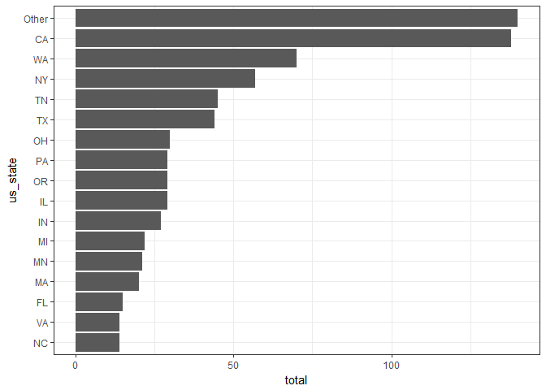

Data Visualization: Part 1
================
YC Huang

-   [Introduction](#introduction)
-   [Setting up the Workspace](#setting-up-the-workspace)
-   [Loading the Data](#loading-the-data)
-   [Visualizing Demographic Variables (Age, Gender, Country, State)](#visualizing-demographic-variables-age-gender-country-state)
-   [Visualizing Survey Responses (Single Variable)](#visualizing-survey-responses-single-variable)
    -   [Initial observations](#initial-observations)
-   [Two-variable Exploratory Analysis](#two-variable-exploratory-analysis)
    -   [By Geographic Region](#by-geographic-region)

Introduction
------------

The data is obtained from [OSMI's Survey on Mental Health in the Tech Workplace in 2014](https://www.kaggle.com/osmi/mental-health-in-tech-survey) and is available as a csv file.

Setting up the Workspace
------------------------

We will be using the following packages.

``` r
library(dplyr)     # data manipulation
library(forcats)   # handle factor variables
library(ggplot2)   # plotting
library(gridExtra) # arrange multiple ggplots
```

Loading the Data
----------------

We had previously cleaned the data and saved it as a RDS file, so we will load the data directly:

``` r
survey_clean <- readRDS("data/survey.rds")
```

Visualizing Demographic Variables (Age, Gender, Country, State)
---------------------------------------------------------------

Based on the `Age` variable, the majority of respondents are within 25-35 years of age. The distribution of respondents is approximately normal, with a little skew towards ages 50 and above. Across `Gender`, about 80% of respondents taking this survey identified as male, alongside females and other genders:

``` r
plot_age <- ggplot(survey_clean, aes(x = Age)) +
    geom_bar() +
    scale_x_continuous(breaks = seq(20, 70, 10))
plot_gender <- ggplot(survey_clean, aes(x = Gender)) +
    geom_bar()
grid.arrange(plot_age, plot_gender, ncol = 1)
```

    ## Warning: Removed 8 rows containing non-finite values (stat_count).


To better visualize the distributions for `Country` and `state`, we group the less frequent responses together using `fct_lump()`, before plotting the data:

``` r
survey_clean %>% 
    # group less frequent responses together
    mutate(Country = fct_lump(Country, n = 9)) %>% 
    group_by(Country) %>% 
    summarise(total = n()) %>% 
    # reordering the country variable so that the countries appear in order of
    # least to most frequent (upward)
    mutate(Country = fct_reorder(Country, total)) %>%
    ggplot(aes(x = Country, y = total)) +
        geom_bar(stat = "identity") +
        coord_flip()
```


``` r
survey_clean %>% 
    # remove NA responses
    filter(!is.na(state)) %>% 
    mutate(us_state = fct_lump(state, n = 15)) %>% 
    group_by(us_state) %>%
    summarise(total = n()) %>%
    mutate(us_state = fct_reorder(us_state, total)) %>%
    ggplot(aes(x = us_state, y = total)) +
        geom_bar(stat = "identity") +
        coord_flip()
```



From the plots above, we can see that a large majority of respondents (751) are from the United States. Among respondents who indicated their US state, most of them came from California.

Visualizing Survey Responses (Single Variable)
----------------------------------------------

There are 21 response variables: `self_employed` to `obs_consequence`, each corresponding to a question on the survey form. We can call `ggplot()` for each variable and examine each plot individually, but we can also iterate this process over multiple variables since we know that they are all `factor`s and we had reordered the response levels during pre-processing.

First, we define the function `plot_by_name()`, it takes two arguments:

-   `col_name` which is the name of the variable to be plotted (a string),
-   `data` which is the dataset to which the variable belongs (a data frame)

The output will be a **bar plot** counting the number of each response in the variable.

``` r
plot_by_name <- function(col_name, data){
    ggplot(data, aes_string(col_name)) +
        geom_bar()
}
```

We can use `lapply()` to iterate the above function over (a subset of) the variable names in our dataset, and then use `grid.arrange()` to display all the plots in the list at once.

``` r
survey_bar1 <- names(survey_clean)[6:14] %>% 
    lapply(plot_by_name, data = survey_clean) %>% 
    grid.arrange(grobs = ., ncol = 3) # pass the list to the grobs parameter
```


``` r
survey_bar2 <- names(survey_clean)[15:23] %>% 
    lapply(plot_by_name, data = survey_clean) %>% 
    grid.arrange(grobs = ., ncol = 3)
```


``` r
survey_bar3 <- names(survey_clean)[24:26] %>% 
    lapply(plot_by_name, data = survey_clean) %>% 
    grid.arrange(grobs = ., ncol = 3)
```


### Initial observations

-   Slightly more than half the respondents indicated they have sought treatment for a mental health condition. (Note that not all respondents may have such a condition)
-   In general, respondents do not indicate high awareness of whether their employers offer benefits, programs or resources for mental health conditions and treatment (`benefits`, `care_options`, `wellness_program`, `seek_help`, `anonymity`, `leave`).
-   Significantly more respondents believed that discussing a mental health issue with their employer would have negative consequences relative to discussing a physical health issue with their employer.
-   However, many respondents appear to be comfortable discussing mental health issues with their coworkers or supervisor (is this implied to be in an informal setting?).
-   This stands in contrast with a clear reluctance to bring up mental health issues in an interview with a potential employer.

Two-variable Exploratory Analysis
---------------------------------

### By Geographic Region

There were more respondents in the United States who have sought treatment for mental health conditions than those who did not. This difference was barely significant for respondents in the United Kingdom and Canada (which had the 2nd and 3rd most respondents by country). Amongst other countries, most respondents have *not* sought mental health treatment.

``` r
survey_clean %>% 
    mutate(Country = fct_lump(Country, 3)) %>% 
    ggplot(aes(x = Country, fill = treatment)) +
    geom_bar(position = position_dodge()) +
    labs(fill = "Seek treatment")
```


Across the United States, most states had more respondents seeking mental health treatment than otherwise. One notable exception would be Tennessee according to the following plot, but the sample size and absolute difference are too small to infer significant conclusions.

``` r
survey_clean %>% 
    filter(!is.na(state)) %>% 
    mutate(us_state = fct_lump(state, 10)) %>% 
    ggplot(aes(x = us_state, fill = treatment)) +
    geom_bar(position = position_dodge()) +
    labs(x = "US State", fill = "Seek treatment")
```


